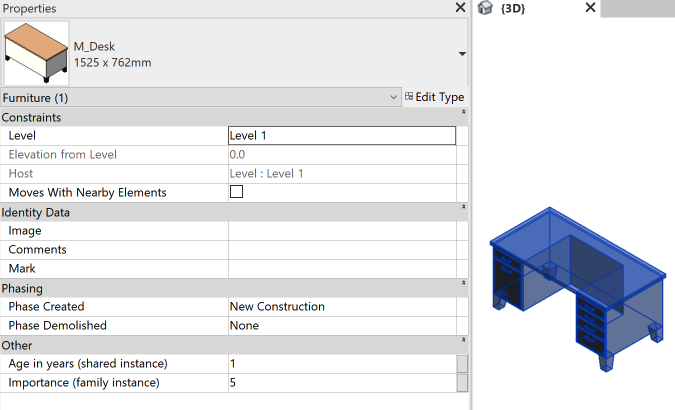
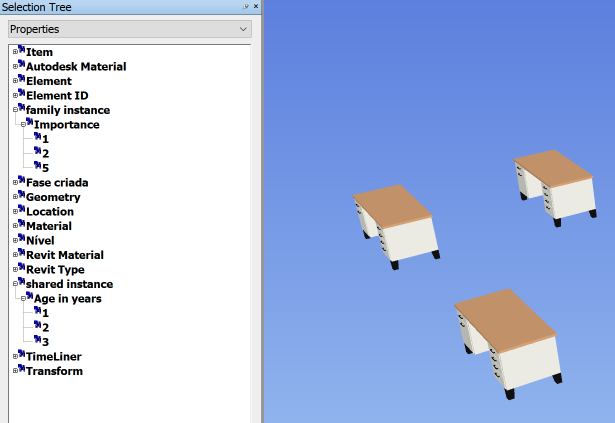

# forge-nodes-properties Sample

This sample demonstrates a way isolate instance parameters in property panel when they're not available on selectable object level. This happens when we have Revit models with instance parameters (shared or not) that get appended in a nwd file. With this translation, the hierarchy of the tree changes.

### DEMO: https://joaomartins-forge.github.io/forge-ar-usdz/

### PREPARATION

This sample is based on our [Docking Panel tutorial](https://learnforge.autodesk.io/#/viewer/extensions/panel).
The main differences are on getAllLeafComponents function that now returns all available nodes and we added a method for changing colors and isolating the proper objects based on its properties.

The changes needed wer due to the way Navisworks has its models hierarchy.

Here's how it's seen in Revit

And here's how it's seen in Navisworks

